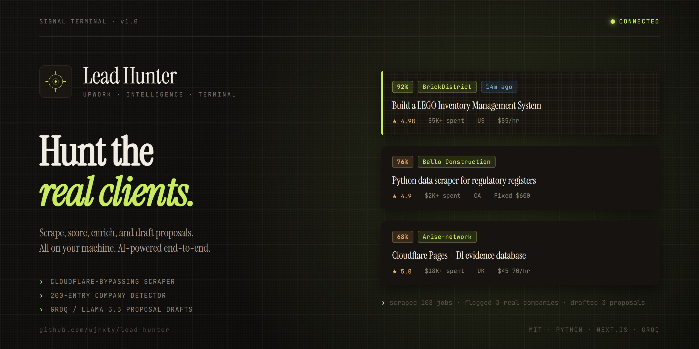

<p align="center">
  
</p>

# Lead Hunter

**AI-powered Upwork intelligence. Surface high-signal job posts, enrich the clients, generate proposals.**

Lead Hunter scrapes Upwork search results, detects real company names in job descriptions (filtering out tech buzzwords), pulls contact info for the companies it finds, and drafts personalised proposals with AI. Runs entirely on your machine.

## What it does

- **Scrapes Upwork** using an undetected Chrome instance that clears Cloudflare
- **Detects real company names** with strict pattern matching + 200-term blocklist
- **Enriches leads** by crawling company websites for emails, phones, social profiles
- **Scores every job** on client history, budget, company confidence
- **Generates full proposals** (cover letter, approach, timeline, questions) via Groq/LLaMA
- **24/7 auto-scraper** with configurable intervals and desktop notifications

## Quick start

### Prerequisites
- Python 3.11+
- Node.js 20+
- Google Chrome
- Groq API key (optional, for AI features)

### Backend

```bash
cd backend
python -m venv venv
venv\Scripts\activate           # Windows
# source venv/bin/activate      # macOS/Linux
pip install -r requirements.txt
python run.py
```

Runs on **http://localhost:8500**

### Frontend

```bash
cd frontend
npm install
npm run dev
```

Runs on **http://localhost:3500**

## First run

1. Open http://localhost:3500
2. Go to **Settings**, paste your Groq API key
3. Click **Connect to Upwork** in the header, complete login in the Chrome window
4. In **Profile**, describe what you do. AI generates search keywords
5. Go to **Signal**, hit Run
6. Toggle "Company signals only" to see jobs worth applying to
7. Click the sparkle icon on any lead to generate a proposal

## 24/7 Auto-Scraper

The **Auto** tab runs scheduled scraping:

1. Create saved searches with your target keywords
2. Toggle "Active" to include them in the scheduler
3. Click **Every 30m** to start

Only jobs with company mentions are stored. Desktop notifications fire when hot leads appear.

## Architecture

```
backend/
  app/
    api/
      routes/          jobs, ai, session, settings, scheduler
      scrapers/        nodriver_scraper.py
      services/        job, ai, enrichment, scheduler, notification
      detectors/       company_detector.py
    core/              config, database
    models/            SQLAlchemy ORM
    schemas/           Pydantic schemas

frontend/
  src/
    app/               Next.js App Router
    components/        React UI components
    lib/               API client, types, store
```

## Configuration

UI-configurable in Settings tab, or via `.env`:

```bash
# backend/.env
GROQ_API_KEY=gsk_...
GROQ_MODEL=llama-3.3-70b-versatile
SCRAPER_HEADLESS=false
```

## API

OpenAPI docs at http://localhost:8500/api/docs

| Method | Path | Description |
|--------|------|-------------|
| POST | /api/jobs/search | Scrape Upwork |
| GET | /api/jobs | List jobs |
| POST | /api/ai/proposal/{id} | Generate proposal |
| POST | /api/ai/enrich/{id} | Enrich contact info |
| GET | /api/scheduler/status | Scheduler status |
| POST | /api/scheduler/start | Start auto-scraper |

## Deployment

**Docker:**
```bash
docker-compose up -d
```

**Cloud:** Frontend on Vercel, backend on Railway/Render/Fly.io (needs Chrome)

## Tech stack

**Backend:** Python 3.11, FastAPI, SQLAlchemy, SQLite, nodriver, Groq SDK, APScheduler
**Frontend:** Next.js 16, React 19, TypeScript, TailwindCSS 4, TanStack Query, Zustand

## Author

Built by **UJ** - ujdeveloper@outlook.com

## License

MIT
